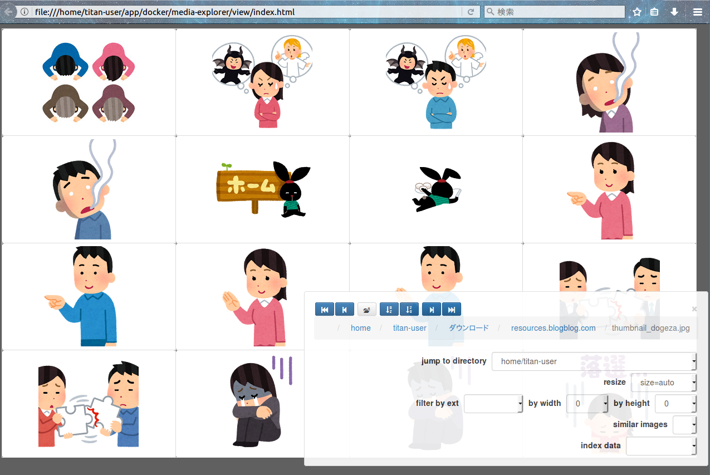

# media-explorer

Media explorer with a web browser for your local storage.

(Showing example images above are downloaded from www.irasutoya.com)

## Requirement

- Python (2.7.14), pip, pip-install, and more.

### Dependency install with pip
In [./fileanalysis](./fileanalysis) directory,

- `pip install pip-tools`
- `pip-compile requirements.in`
- `pip install -r requirements.txt`

### Python 3.5
If you are using 3.5, please modify `unicode` statements in [./fileanalysis/media-indexer.py](./fileanalysis/media-indexer.py).

## How to Use
- Edit [./fileanalysis/media-indexer.py](./fileanalysis/media-indexer.py) and rewrite `directory` var into your targetting dir.
- `python ./fileanalysis/media-indexer.py`
- Open [./view/index.html](./view/index.html) with your browser

### Indexing number of files
In 32 bit OS, The upper limit of `# of files` which the viewer can load is about 60K files.

### Keyboard shortcuts

- u: viewer for multiple files
- s,h: show/hide control pane
- l,b: decrement page 
- other keys: increment page

## License
The files in following directory are NOT provided in MIT license.

- `./view/lib`
